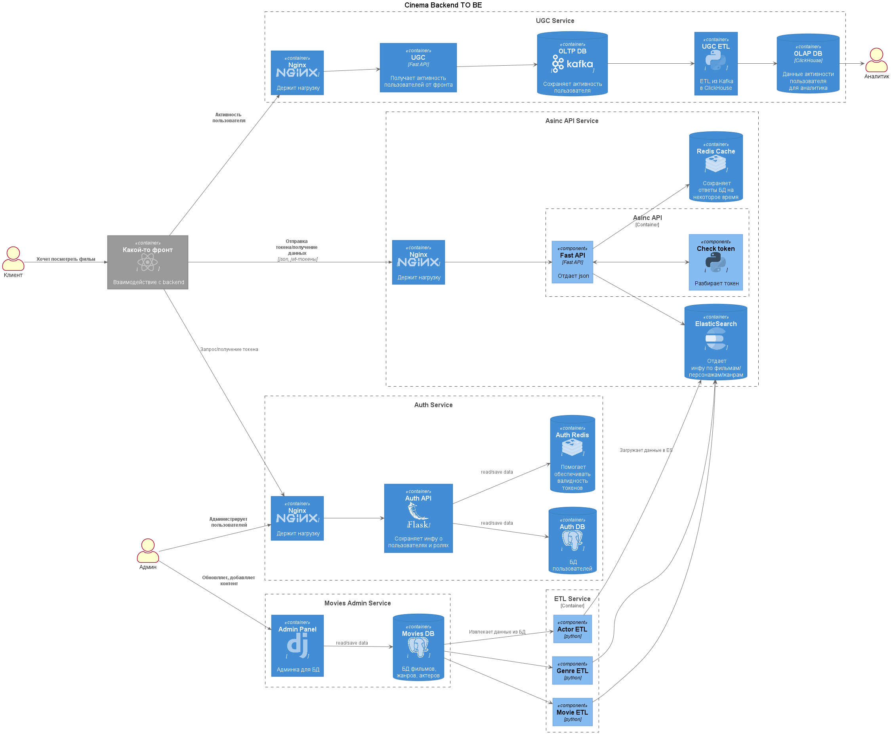

## Архитектура проекта



## Запуск приложения

### Development

Для запуска приложения в среде разработки доступны варианты запуска напрямую через `python` и
через `docker-compose`. Оба варианта используют для конфигурации переменные окружения, которые
описаны в файле `ugc_service/core/config.py`. В данных режимах запуска доступно обновление кода приложения
на лету, без перезапуска (кроме случаев добавления новых зависимостей).

# GitHub Actions
GitHub Actions работают при мердже в dev и main ветки. Производится проверка линтером wemake, проверка типов mypy и
запуск тестов.

# Исследования хранилищ
Исследования хранилищ mongo и clickhouse находятся в папке mongo_test.

# You can start Fast api server by runing .

```bash
$ docker-compose up -d  --bulid
```
# Or locally
```bash
$  python -m ugc_service
```

### Перед началом работы

```bash
make dev
```

Это позволит проверить внесённые изменения до их сохранения.

### Зависимости

Управлением зависимостями занимается утилита `poetry`. \
Перечень зависимостей находится в файле `pyproject.toml`. \
Инструкция по настройке poetry-окружения для
pyCharm [здесь](https://www.jetbrains.com/help/pycharm/poetry.html).

Для добавления зависимости достаточно написать `poetry add requests`, утилита сама подберёт версию,
не конфликтующую с текущими зависимостями. \
Зависимости с точными версиями фиксируются в файл `poetry.lock`. \
Для получения дерева зависимостей можно воспользоваться командой `poetry show --tree`. Остальные
команды доступны в официальной документации к утилите.

### Тестирование

Тесты оформлены в виде полностью независимого решения, в котором не используется код основной
программы. Для запуска тестирования достаточно вызвать в корне проекта команду

# Test

```bash
$  make test
```

# Clean tests

```bash
$  make test-cleanup
```
